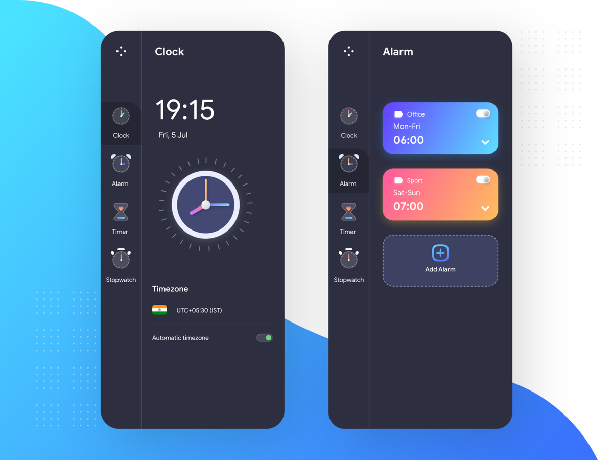

# Flutter Alarm Clock


A cross-platform Flutter alarm clock application featuring an analog/digital clock display, SQLite-persisted alarm scheduling, and platform-native local notifications. Built with a clean Provider-based state management architecture and multi-platform notification initialization for Android, iOS/macOS, and Windows.

---

## Problem Statement / Objective

Managing time effectively across multiple platforms requires a consistent, reliable alarm experience. Native clock applications are platform-locked and lack a unified codebase. This project demonstrates how a single Flutter codebase can deliver a fully-functional alarm clock with:

- **Persistent alarm storage** via SQLite (survives app restarts)
- **Scheduled local notifications** with platform-specific sound and icon configuration
- **Scalable UI architecture** using Provider for reactive state management
- **Cross-platform support** with platform-specific initialization for Android, iOS/macOS, and Windows

The primary objective is to showcase production-quality engineering practices — singleton data access, clean separation of concerns, and scalable widget composition — within a real-world Flutter application.

---

## Features

| Feature | Details |
|---|---|
| Analog Clock | Custom `ClockPainter` using Flutter `CustomPainter` with gradient clock hands and tick marks |
| Digital Clock | Live `HH:mm` display, timer-driven update every second |
| Timezone Display | Reads device UTC offset and renders `UTC±HH:mm` |
| Alarm Scheduling | Time picker → SQLite insert → `zonedSchedule` notification |
| Repeating Alarms | Optional repeat via `DateTimeComponents.time` matching |
| Local Notifications | `flutter_local_notifications` with Android, Darwin (iOS/macOS), Windows support |
| SQLite Persistence | Alarms stored in `alarm.db` via `sqflite`; survive app restarts |
| Gradient Alarm Cards | Up to 5 alarms, each with a unique gradient color theme |
| Delete Alarm | Remove alarm from DB and dismiss pending notification |
| Multi-Screen Navigation | Side menu for Clock, Alarm, Timer, Stopwatch (Timer/Stopwatch: planned) |
| Provider State Management | `MenuInfo` `ChangeNotifier` drives view switching reactively |
| Custom Font | Avenir font family (Book, Medium, Heavy, Light weights) |

---

## Tech Stack

| Category | Technology | Version |
|---|---|---|
| Language | Dart | ≥ 2.16.2, < 3.0.0 |
| Framework | Flutter | 3.x |
| State Management | Provider | ^6.0.3 |
| Local Database | sqflite (SQLite) | ^2.4.2 |
| Notifications | flutter_local_notifications | ^19.0.0 |
| UI Components | dotted_border | ^2.0.0+2 |
| Internationalisation | intl | ^0.20.2 |
| Linting | flutter_lints | ^5.0.0 |
| Platforms | Android, iOS, macOS, Windows | — |

---

## System Architecture / Workflow

```
┌─────────────────────────────────────────────────────────┐
│                        main.dart                        │
│  • Platform notification plugin initialization          │
│  • ChangeNotifierProvider<MenuInfo> (root Provider)     │
└────────────────────────┬────────────────────────────────┘
                         │
                         ▼
              ┌──────────────────────┐
              │      HomePage        │  ← StatefulWidget
              │  Side menu + Consumer│
              └──────┬───────────────┘
                     │ MenuType (Provider)
         ┌───────────┼────────────┐
         ▼           ▼            ▼
    ClockPage    AlarmPage    (Timer/Stopwatch)
    ─────────    ─────────    ───────────────
    ClockView    FutureBuilder  Placeholder
    (Custom      + AlarmHelper  "Upcoming
    Painter)     (Singleton)    Tutorial"
         │           │
         │           ▼
         │    ┌──────────────┐
         │    │  AlarmHelper │  ← Singleton
         │    │  (sqflite)   │
         │    └──────┬───────┘
         │           │  CRUD
         │           ▼
         │    ┌──────────────┐
         │    │  alarm.db    │  ← SQLite
         │    │  (alarm tbl) │
         │    └──────────────┘
         │
         ▼
  FlutterLocalNotificationsPlugin
  ┌────────────────────────────────┐
  │ Android: AndroidNotifDetails   │
  │ iOS/macOS: DarwinNotifDetails  │
  │ Windows: WindowsNotifDetails   │
  └────────────────────────────────┘
```

**Data flow for scheduling an alarm:**

1. User selects time via `showTimePicker`
2. `AlarmPage.onSaveAlarm()` creates an `AlarmInfo` object
3. `AlarmHelper.insertAlarm()` persists it to SQLite
4. `AlarmPage.scheduleAlarm()` calls `flutterLocalNotificationsPlugin.zonedSchedule()` with TZ-aware `TZDateTime`
5. On trigger, the OS delivers a notification; foreground/background handlers log the payload

---

## Installation & Setup

### Prerequisites

- [Flutter SDK](https://flutter.dev/docs/get-started/install) installed and on `PATH`
- Dart SDK ≥ 2.16.2 (bundled with Flutter)
- Platform toolchain for your target:
  - **Android**: Android Studio + Android SDK (API 21+)
  - **iOS / macOS**: Xcode 15+ with Command Line Tools
  - **Windows**: Visual Studio 2022 with "Desktop development with C++" workload

### Clone & Install

```bash
git clone https://github.com/SBK-07/alarm-clock-flutter.git
cd alarm-clock-flutter
flutter pub get
```

### Platform-Specific Setup

#### Android

1. Add a notification icon named `codex_logo` (PNG) to `android/app/src/main/res/drawable/`.
2. For API 33+ (Android 13), add the `POST_NOTIFICATIONS` permission to `AndroidManifest.xml`:
   ```xml
   <uses-permission android:name="android.permission.POST_NOTIFICATIONS"/>
   ```
3. For exact alarms on API 31+, add:
   ```xml
   <uses-permission android:name="android.permission.SCHEDULE_EXACT_ALARM"/>
   ```

#### iOS / macOS

1. In `Info.plist`, ensure notification-related keys are present.
2. In Xcode, enable the **Push Notifications** capability for your target.
3. `DarwinInitializationSettings` in `main.dart` requests alert, badge, and sound permissions at launch.

#### Windows

1. Toast notifications must be enabled in Windows system settings.
2. The `WindowsInitializationSettings` in `main.dart` is pre-configured with `appName`, `appUserModelId`, and `guid`.
3. Optionally place your app icon at the path specified in `iconPath`.

---

## Usage

### Running the App

```bash
# Default device / emulator
flutter run

# Specific platform
flutter run -d android
flutter run -d ios
flutter run -d windows
flutter run -d macos
```

### Building for Release

```bash
flutter build apk --release          # Android APK
flutter build appbundle --release    # Android App Bundle
flutter build ios --release          # iOS
flutter build macos --release        # macOS
flutter build windows --release      # Windows
```

### App Workflow

1. **Clock tab** — Displays an analog clock (custom painter) and a live digital clock with the current date and UTC timezone offset.
2. **Alarm tab** — Lists persisted alarms as gradient cards. Tap **Add Alarm** (dotted border button) to open the bottom sheet:
   - Pick a time via the material time picker.
   - Toggle **Repeat** to enable daily recurrence.
   - Press **Save** to persist and schedule the alarm.
3. **Delete** — Tap the trash icon on any alarm card to remove it from the database.

> **Timer & Stopwatch** tabs are navigable but display a placeholder pending future implementation.

---

## Screenshots / Demo



> *The app running on desktop — analog clock face with gradient clock hands, side navigation menu, and the alarm management screen with color-coded alarm cards.*

---

## API Integration

**Not applicable.** This project operates entirely offline. All data persistence is handled locally via SQLite (`sqflite`), and all notifications are delivered through the device's OS notification system via `flutter_local_notifications`. No external APIs, REST endpoints, or cloud services are used.

---

## Folder Structure

```
alarm-clock-flutter/
├── android/                        # Android platform project
├── ios/                            # iOS platform project
├── macos/                          # macOS platform project
├── windows/                        # Windows platform project
├── linux/                          # Linux platform project (stub)
├── web/                            # Web platform project (stub)
├── assets/
│   ├── fonts/                      # Avenir font family (Book, Medium, Heavy, Light)
│   ├── add_alarm.png               # Icon: add alarm button
│   ├── alarm_icon.png              # Icon: alarm menu item
│   ├── clock_icon.png              # Icon: clock menu item
│   ├── stopwatch_icon.png          # Icon: stopwatch menu item
│   └── timer_icon.png              # Icon: timer menu item
├── lib/
│   ├── main.dart                   # Entry point; notification plugin init; root widget
│   ├── alarm_helper.dart           # Singleton SQLite data access layer (CRUD)
│   └── app/
│       ├── data/
│       │   ├── data.dart           # Static menu items and sample alarm data
│       │   ├── enums.dart          # MenuType enum (clock, alarm, timer, stopwatch)
│       │   ├── theme_data.dart     # CustomColors and GradientTemplate definitions
│       │   └── models/
│       │       ├── alarm_info.dart # AlarmInfo model with toMap/fromMap serialization
│       │       └── menu_info.dart  # MenuInfo ChangeNotifier (Provider state)
│       └── modules/
│           └── views/
│               ├── homepage.dart   # Root layout; side menu; Consumer<MenuInfo>
│               ├── clock_page.dart # Digital clock + ClockView; timezone display
│               ├── clockview.dart  # Analog clock via CustomPainter
│               └── alarm_page.dart # Alarm list, add/delete, notification scheduling
├── test/
│   └── widget_test.dart            # Flutter widget tests
├── pubspec.yaml                    # Project metadata and dependencies
├── analysis_options.yaml           # Dart linting rules
└── flutter_clock_app.png           # App screenshot
```

---

## Future Enhancements / Roadmap

| Enhancement |
|---|
| **Timer module** — countdown timer with start/pause/reset and notification on completion |
| **Stopwatch module** — lap tracking with millisecond precision |
| **Alarm label editor** — allow custom title input when creating an alarm |
| **Alarm sound picker** — select from bundled or device ringtones |
| **Snooze functionality** — postpone alarm by a configurable interval |
| **World clocks** — add/remove cities, display multiple timezone clocks |
| **Dark/Light theme toggle** — extend `CustomColors` to support theming |
| **Widget (home screen)** — Android/iOS home screen widget showing the next alarm |
| **Alarm statistics** — track alarm history and wake-up consistency |
| **iCloud / Google Drive sync** — backup alarm data to cloud storage |
| **Linux / Web support** — extend `flutter_local_notifications` initialization for remaining platforms |

---

## Contributing

Contributions are welcome. Please follow this workflow:

1. **Fork** the repository and create a feature branch:
   ```bash
   git checkout -b feature/your-feature-name
   ```
2. **Implement** your changes with clear, focused commits.
3. **Test** on at least one platform (`flutter run -d <device>`).
4. **Lint** your code:
   ```bash
   flutter analyze
   ```
5. **Open a Pull Request** with a descriptive title and a summary of changes.

### Guidelines

- Follow Dart/Flutter best practices and the existing code style.
- Keep widgets single-responsibility; extract reusable widgets where appropriate.
- Document any new public APIs with Dart doc comments.
- Do not commit generated files (`build/`, `.dart_tool/`, etc.).

---

## License

No license file is currently included in this repository. All rights are reserved by the author unless a license is explicitly added. If you intend to use or contribute to this project, please contact the author.

---

## Author / Contact

**Suraj B K**
- GitHub: [@SBK-07](https://github.com/SBK-07)
- Repository: [alarm-clock-flutter](https://github.com/SBK-07/alarm-clock-flutter)

---

*Built with Flutter — write once, run everywhere.*

